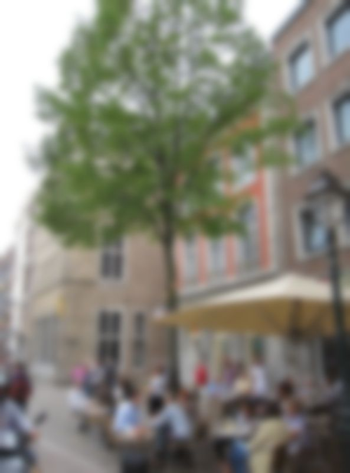
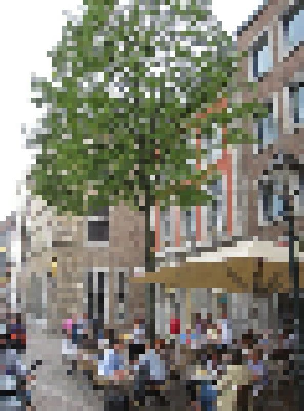
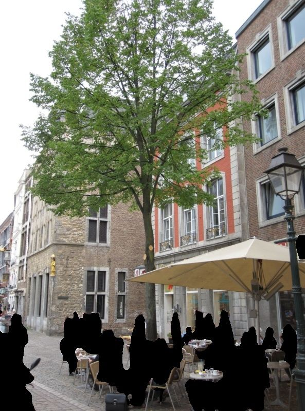
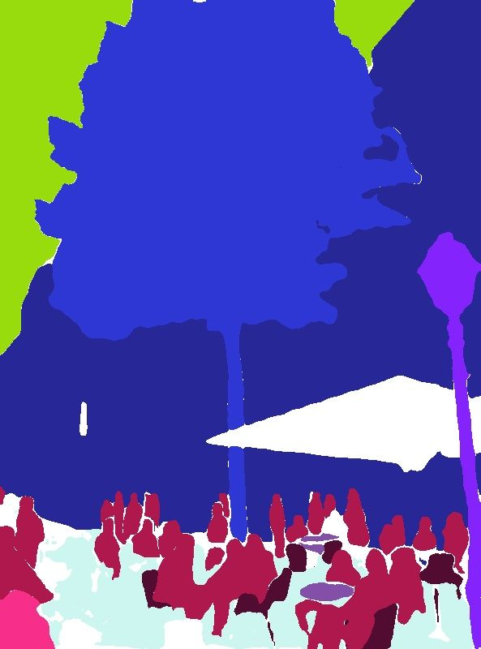
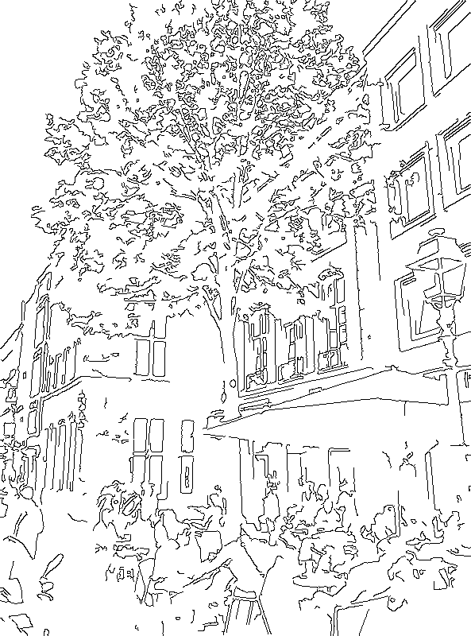
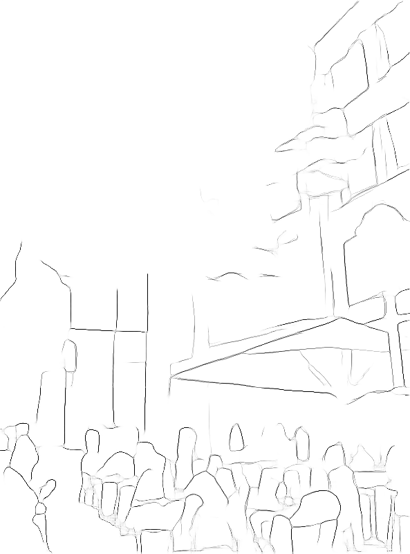
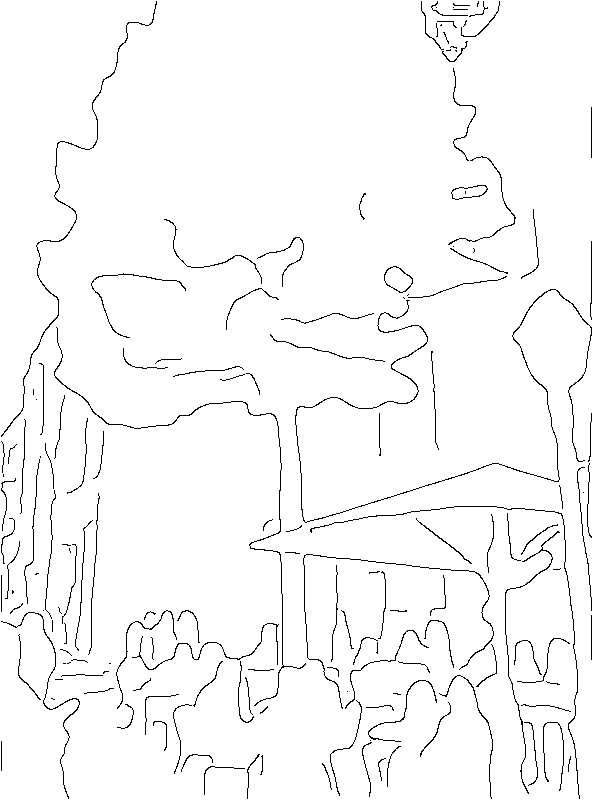
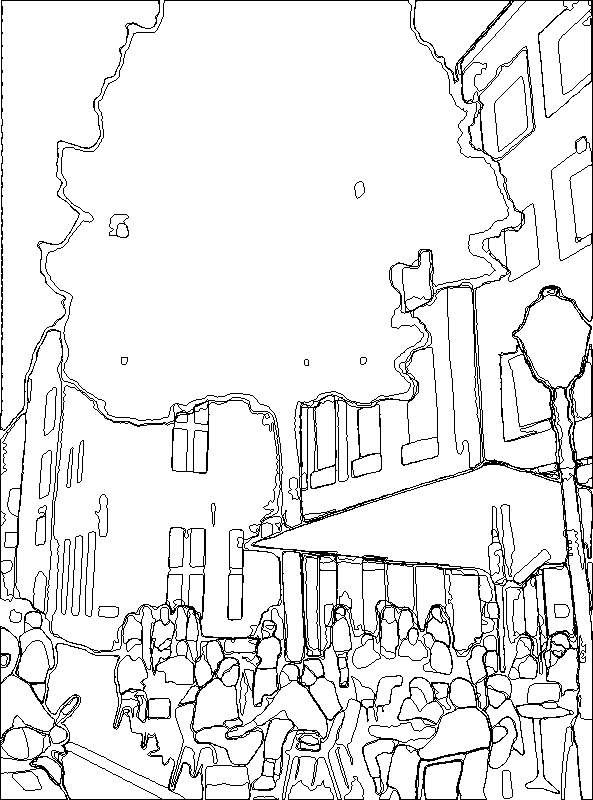
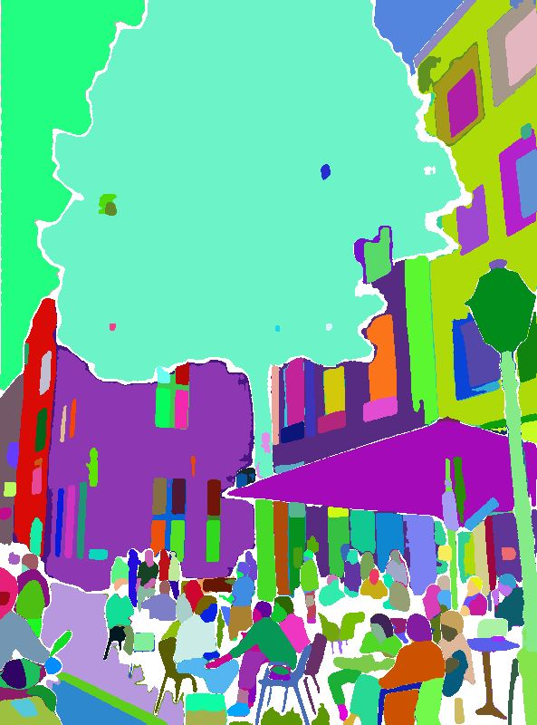

# Privacy-Preserving Structureless Visual Localization via Image Obfuscation

[](https://arxiv.org/abs/2604.12068)

Basic implementation of the pipeline described in the [paper](https://arxiv.org/abs/2604.12068) presented at Image Matching CVPR 2026 Workshop.

## Installation

```bash
git clone https://github.com/spatial-intelligence-group/obfusloc.git
git submodule update --init --depth 1

uv venv --python 3.12
source .venv/bin/activate
uv pip install <torch> <torchvision> [<xformers>] --index-url https://download.pytorch.org/whl/<cu>
CUDA_HOME=<cuda-path> PATH=<cuda-path>/bin:$PATH \
    uv pip install -r requirements.txt --override requirements_override.txt --no-build-isolation
```

Based on your CUDA version, you can pick the correct package version from the table:

| CUDA | `<torch>` | `<torchvision>` | `<xformers>` | `<cu>` | `<cuda-path>` |
|------|-----------|-----------------|--------------|--------|---------------|
| 13.0 | `torch==2.9.0` | `torchvision==0.24.0` | `xformers==0.0.33` | `cu130` | `/usr/local/cuda-13.0` |
| 12.4 | `torch==2.6.0` | `torchvision==0.21.0` | `xformers==0.0.29.post3` | `cu124` | `/usr/local/cuda-12.4` |
| 11.8 | `torch==2.6.0` | `torchvision==0.21.0` | `xformers==0.0.29.post3` | `cu118` | `/usr/local/cuda-11.8` |

**`CUDA_HOME` prefix:** can be omitted if you have only single CUDA version installed in its default location.


## Obfuscations from the paper

<table style="table-layout: fixed; width: 100%;">
  <tr>
    <td width="20%"></td>
    <td width="20%"></td>
    <td width="20%"></td>
    <td width="20%"></td>
    <td width="20%"></td>
  </tr>
  <tr>
    <td align="center">original</td>
    <td align="center">blur</td>
    <td align="center">pixelization</td>
    <td align="center">easy-anon</td>
    <td align="center">Mask2Former</td>
  </tr>
  <tr>
    <td width="20%"></td>
    <td width="20%"></td>
    <td width="20%"></td>
    <td width="20%"></td>
    <td width="20%"></td>
  </tr>
  <tr>
    <td align="center">Canny</td>
    <td align="center">DiffusionEdge</td>
    <td align="center">Metric3D --> Canny</td>
    <td align="center">SAM borders</td>
    <td align="center">SAM masks</td>
  </tr>
</table>

All the obfuscation scripts are in `scripts/obfuscation`.

**blur** and **pixelization**
- Classic image obfuscations - blurring with Gaussian kernel and pixelization.
- Implemented in [`blur_or_pixelize_inference.py`](scripts/obfuscation/blur_or_pixelize_inference.py).

**easy-anon**
- Anonymization by masking certain parts of the image based on semantic segmentation.
- Not present in this repository - implemented in [github.com/spatial-intelligence-group/easy_anon](https://github.com/spatial-intelligence-group/easy_anon).

**Canny**
- Extraction of edges using Canny edge detector. CLAHE is applied before edge extraction.
- Implemented in [`canny_inference.py`](scripts/obfuscation/canny_inference.py).
- The results in the paper should be generated with the default parameters.

**Metric3D --> Canny**
- Canny edges extracted from monocular depth maps generated by Metric3D.
- First run [`metric3d_inference.py`](scripts/obfuscation/metric3d_inference.py) to produce depth maps, then run [`depth2edge.py`](scripts/obfuscation/depth2edge.py) on the generated depth maps.

**DiffusionEdge**
- Edge extraction using a diffusion model.
- Implemented in [`diffusion_edge_inference.py`](scripts/obfuscation/diffusion_edge_inference.py).
- We used the model pretrained on NYUD: https://github.com/GuHuangAI/DiffusionEdge/releases/download/v1.1/nyud.pt

**SAM1**
- Mask extraction using Segment Anything Model 1 (SAM1) automatic mask generator.
- Use [`sam1_inference.py`](scripts/obfuscation/sam1_inference.py).
- Also supports filtering the grid points by [DB text detector](https://docs.opencv.org/4.x/db/d0f/classcv_1_1dnn_1_1TextDetectionModel__DB.html) (so the text is not visible in the SAM masks). Download and use the pretrained model listed in the documentation.

**SAM2**
- Mask extraction using Segment Anything Model 2 (SAM2) automatic mask generator.
- Use [`sam2_inference.py`](scripts/obfuscation/sam2_inference.py).
- Same as SAM1, the script also supports filtering the grid points by DB text detector.
**Mask2Former**
- Mask extraction using Mask2Former semantic/panoptic segmentation.
- Use [`mask2former_inference.py`](scripts/obfuscation/mask2former_inference.py).


## Localization

There are two localization pipelines:

- E5+1 pipeline: [`loc_pipeline_gen_rel_pose.py`](scripts/localization/loc_pipeline_gen_rel_pose.py)
- local triangulation pipeline: [`loc_pipeline_local_triang.py`](scripts/localization/loc_pipeline_local_triang.py)

Utility scripts for data preparation and evaluation are present in `scripts/utils`


## Acknowledgements

We want to thank the authors and contributors of all the projects used in our work. Mainly, but not limited to:

- [OpenCV](https://github.com/opencv/opencv)
- [Metric3D](https://github.com/yvanyin/metric3d)
- [DiffusionEdge](https://github.com/GuHuangAI/DiffusionEdge)
- [SAM1](https://github.com/facebookresearch/segment-anything)
- [SAM2](https://github.com/facebookresearch/sam2)
- [Mask2Former](https://github.com/facebookresearch/Mask2Former)
- [hloc](https://github.com/cvg/Hierarchical-Localization)
- [RoMa](https://github.com/Parskatt/RoMa/)
- [COLMAP](https://github.com/colmap/colmap)
- [PoseLib](https://github.com/PoseLib/PoseLib)


## Citation

```bibtex
@InProceedings{Panek_2026_ObfusLoc,
  title={Privacy-Preserving Structureless Visual Localization via Image Obfuscation},
  author={Panek, Vojtech and Beliansky, Patrik and Kukelova, Zuzana and Sattler, Torsten},
  booktitle = {Proceedings of the IEEE/CVF Conference on Computer Vision and Pattern Recognition (CVPR) Workshops},
  month     = {June},
  year      = {2026},
  pages={117--128},
}
```
